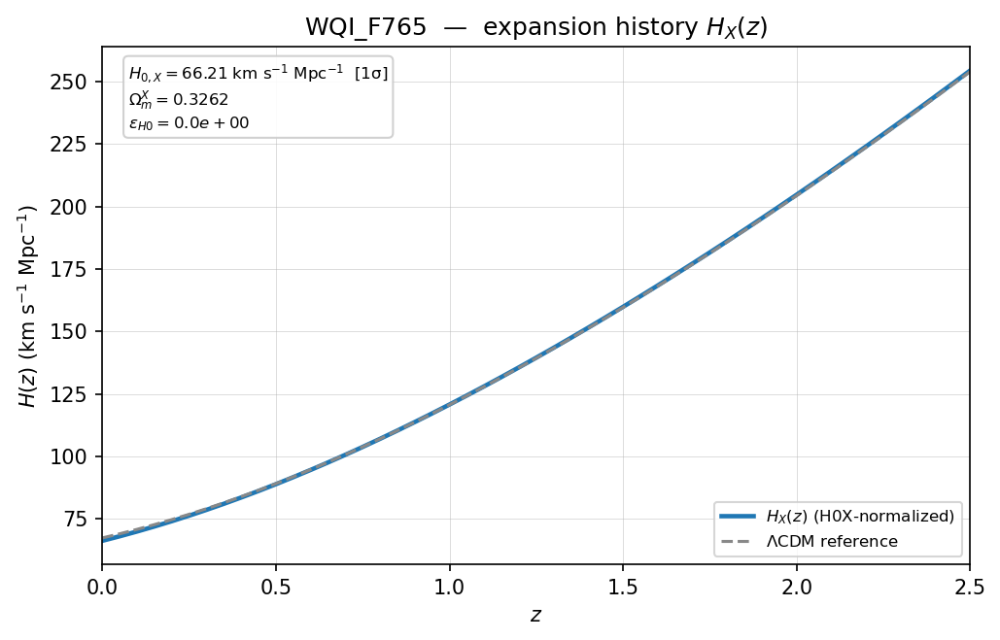
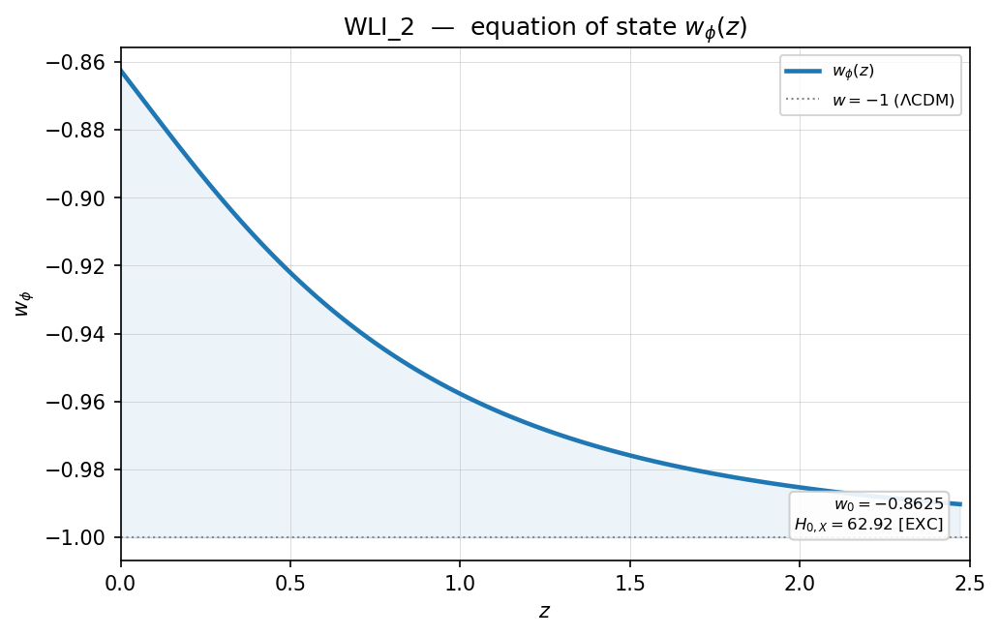
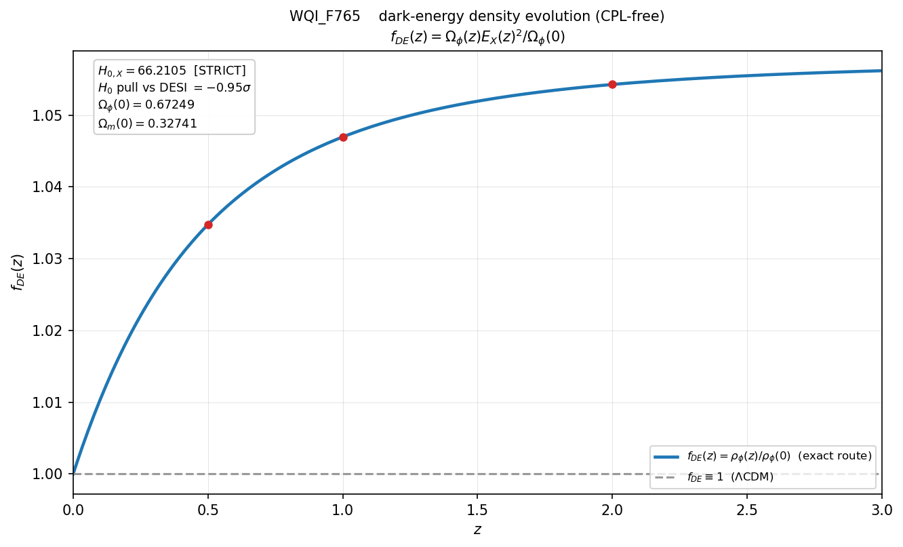
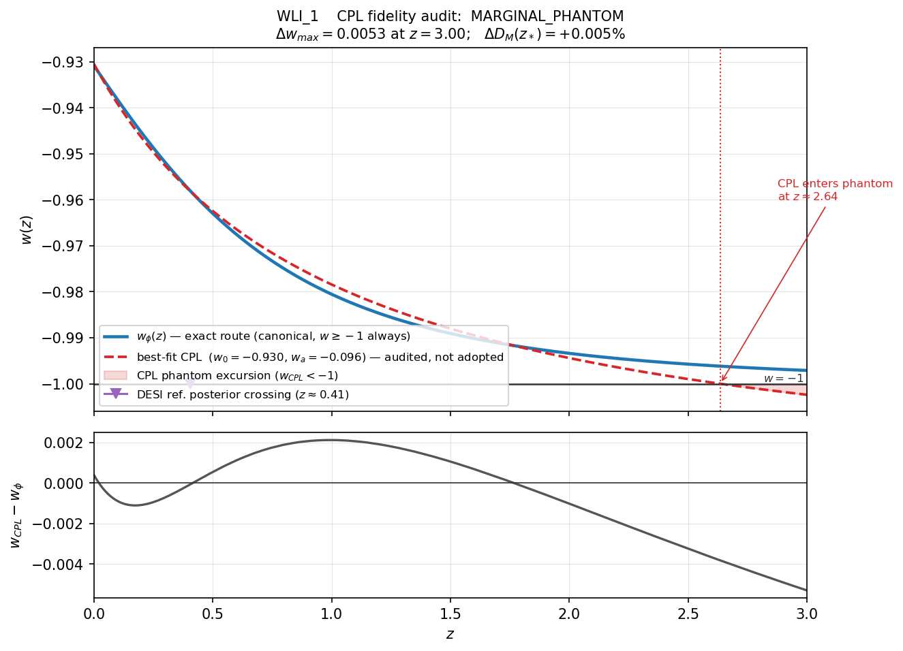
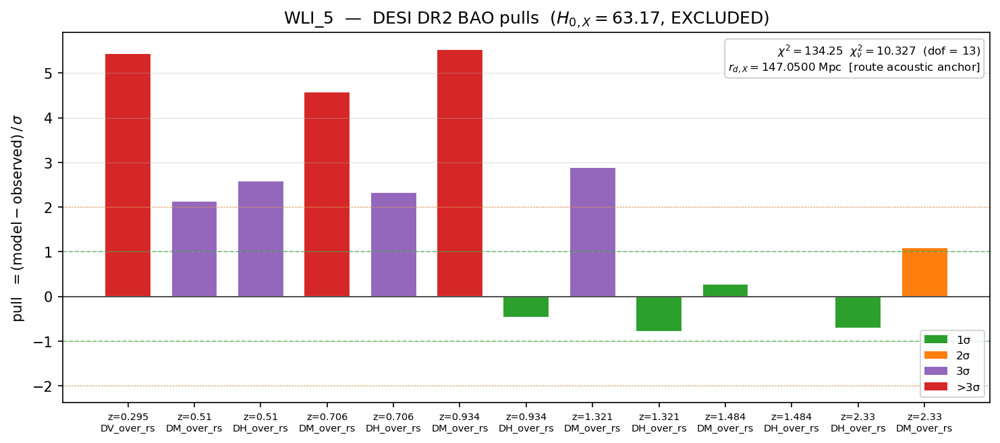
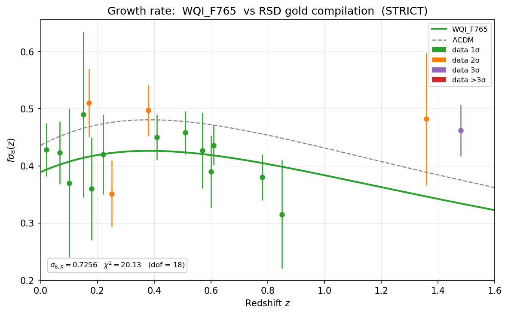

# Plot Outputs Reference

TFA writes diagnostic plots into each run folder. The release repository also
includes a small gallery of sample plots in:

```text
figures/
```

The gallery files were copied from the demonstration run outputs of the
current release and include both raster (`.png`) and vector (`.pdf`)
versions.

## Plot products

| Plot stem | Written by | Availability | Purpose |
|---|---|---|---|
| `w_of_z` | `tfa_plot_exporter` | Always after successful acoustic integration. | Scalar equation-of-state history at low redshift. |
| `Omega_phi` | `tfa_plot_exporter` | Always. | Scalar energy-density fraction over the trajectory. |
| `phase_portrait` | `tfa_plot_exporter` | Always. | Scalar-field phase trajectory `(phi, dphi/dN)`. |
| `energy_fractions` | `tfa_plot_exporter` | Always (uses the `energy_fractions` summary block). | Low-redshift route vs reference matter/dark-energy fractions with equality redshifts. |
| `H_of_z` | `tfa_plot_exporter` | Requires `expansion_history_h0x_normalized.csv` (gated). | The route Hubble history after the required normalization. |
| `delta_H` | `tfa_plot_exporter` | Requires the normalized history (gated). | Difference between route and reference Hubble histories. |
| `bao_pulls` | `tfa_bao_validator` | Requires successful BAO validation (gated). | BAO per-datum normalized residuals. |
| `rsd_pulls` | `tfa_rsd_validator` | Requires successful RSD validation (gated). | RSD per-datum normalized residuals. |
| `rsd_growth` | `tfa_rsd_validator` | Requires successful RSD validation (gated). | Route `f_sigma8(z)` curve against the compilation. |
| `density_fde` | `tfa_density_validator` | Always (non-gated). | Exact dark-energy density evolution `f_DE(z) = rho_phi(z)/rho_phi(0)` against the LCDM constant `f_DE = 1`. |
| `cpl_fidelity` | `tfa_cpl_fidelity_validator` | Always (non-gated). | Exact route `w(z)` vs its best-fit CPL, with the CPL phantom excursion shaded and the crossing redshift annotated; residual panel below. |

When the export gate rejects a route, the gated plots are skipped because the
normalized-history CSV is absent. The scalar-state plots, `density_fde`, and
`cpl_fidelity` are written for every completed run, including `EXCLUDED`
routes.

## Sample gallery

The `figures/` folder contains the following sample plots:

| File | Description |
|---|---|
| `WQI_F765_H_of_z.png/pdf` | Normalized expansion history for `WQI_F765` (STRICT). |
| `WLI_4_H_of_z.png/pdf` | Normalized expansion history for `WLI_4` (LOOSE_3S). |
| `WQI_F680_w_of_z.png/pdf` | Scalar equation-of-state history for `WQI_F680`. |
| `WLI_2_w_of_z.png/pdf` | Scalar equation-of-state history for `WLI_2` (EXCLUDED; strong thawing). |
| `WLI_1_Omega_phi.png/pdf` | Scalar energy-density fraction for `WLI_1`. |
| `WLI_6_Omega_phi.png/pdf` | Scalar energy-density fraction for `WLI_6`. |
| `WLI_4_energy_fractions.png/pdf` | Low-redshift energy-fraction comparison for `WLI_4`. |
| `WQI_F765_density_fde.png/pdf` | Dark-energy density evolution `f_DE(z)` for `WQI_F765`. |
| `WLI_1_cpl_fidelity.png/pdf` | CPL fidelity audit for `WLI_1` (mild thawing). |
| `WLI_3_cpl_fidelity.png/pdf` | CPL fidelity audit for `WLI_3` (strong thawing). |
| `WLI_1_bao_pulls.png/pdf` | BAO pull diagnostics for `WLI_1` (in-band route). |
| `WLI_5_bao_pulls.png/pdf` | BAO pull diagnostics for `WLI_5` (EXCLUDED; gate-disabled run). |
| `WLI_1_rsd_pulls.png/pdf` | RSD pull diagnostics for `WLI_1`. |
| `WLI_3_rsd_pulls.png/pdf` | RSD pull diagnostics for `WLI_3` (gate-disabled run). |
| `WQI_F765_rsd_growth.png/pdf` | RSD growth-rate comparison for `WQI_F765`. |
| `WQI_F765_phase_portrait.png/pdf` | Phase portrait for `WQI_F765`. |

## How to read the plots

### Normalized expansion history

`H_of_z` plots show the route's low-redshift Hubble history after the
required normalization has fixed `H0_X` and the distance scale. Inspect this
plot before moving to scalar-state or observational-pull diagnostics because
it shows the background that BAO and RSD consume.



### Scalar equation of state

`w_of_z` plots show the scalar equation-of-state history `w_phi(z)`. They are
a quick visual check of thawing behavior: the field sits at `w = -1` in the
past and rises at late times, more steeply for stronger thawing.



### Scalar density fraction and energy budget

`Omega_phi` plots show the scalar energy-density fraction;
`energy_fractions` plots compare the route's low-redshift matter and
dark-energy fractions with the LCDM reference and mark both equality
redshifts. They use the `energy_fractions` block written into
`run_results_summary.json`.


### Dark-energy density evolution

`density_fde` plots show the exact density evolution
`f_DE(z) = rho_phi(z)/rho_phi(0)` computed from the trajectory with no
parametrization. LCDM is the constant `f_DE = 1`; a thawing route rises above
it toward the past (the frozen field held more energy than today's thawed
field) and plateaus where the field is frozen. The departure from 1 is the
density validator's distance-from-Lambda indicator.



### CPL fidelity audit

`cpl_fidelity` plots show the route's exact `w_phi(z)` against its best-fit
CPL. The `w = -1` line is drawn hard; the region where the CPL fit dips below
it is shaded, with the crossing redshift annotated. The exact route never
touches the shaded region (the canonical sector forbids it); the fit always
does for a thawing route. The bottom panel shows the residual
`w_CPL - w_phi`, growing toward high redshift. The marker on the `w = -1`
line is the DESI reference posterior's own crossing.



### BAO pulls

`bao_pulls` plots encode the BAO residual vector in one panel. Each bar is a
normalized residual `(model - observed) / sigma`, colored by the sigma band
it falls in. Use this plot to identify which redshifts and observables
dominate the BAO chi-squared. For acoustically excluded routes (gate-disabled
runs), the coherent drift of the bars is the visual form of the degraded
chi-squared.



### RSD pulls and growth

`rsd_pulls` uses the same pull-bar format for the `f_sigma8` compilation.
`rsd_growth` overlays the route's `f_sigma8(z)` prediction directly on the
data points with uncertainty bars.



### Phase portrait

The phase portrait traces `(phi, dphi/dN)` from the frozen initial condition
toward the present epoch.


## Source data

Plots are inspection products. The citeable numerical source remains the CSV
and JSON output in the run folder:

- `trajectory.csv`
- `expansion_history_h0x_normalized.csv`
- `bao_results_per_datum.csv`
- `rsd_results_per_datum.csv`
- `density_results.csv`
- `cpl_fidelity_results.csv`
- `run_results_summary.json`

See `docs/csv-outputs-reference.md` and `docs/run-summary-reference.md` for
the field-level documentation behind the plotted values.
