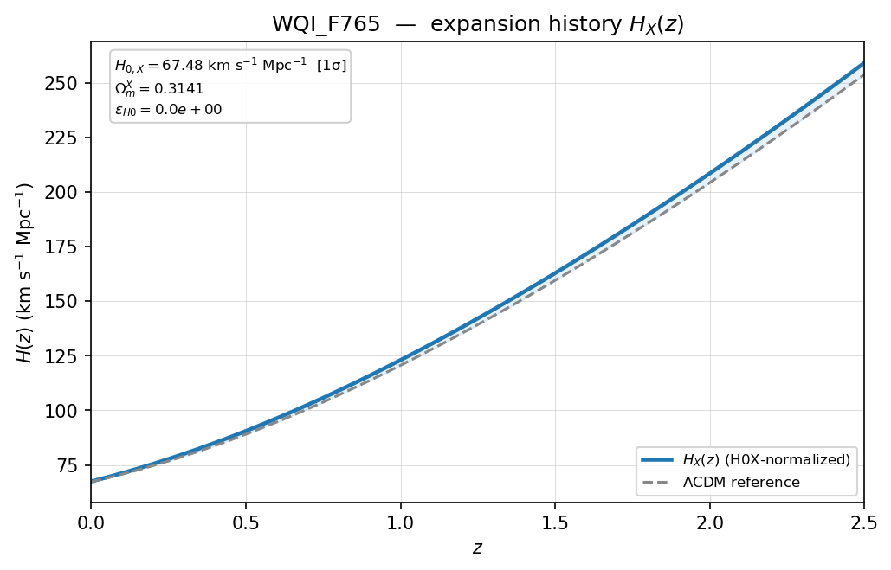
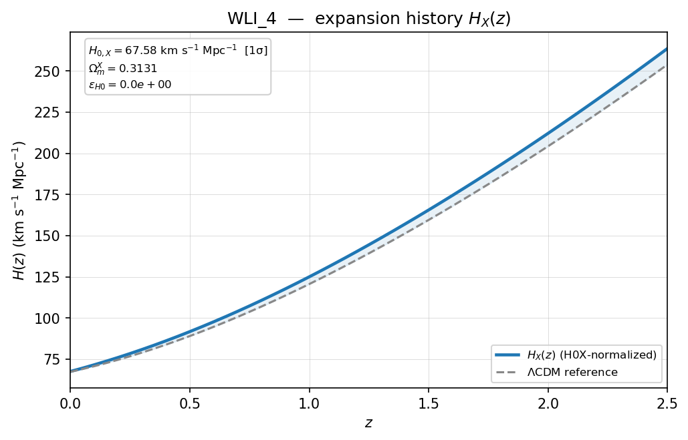
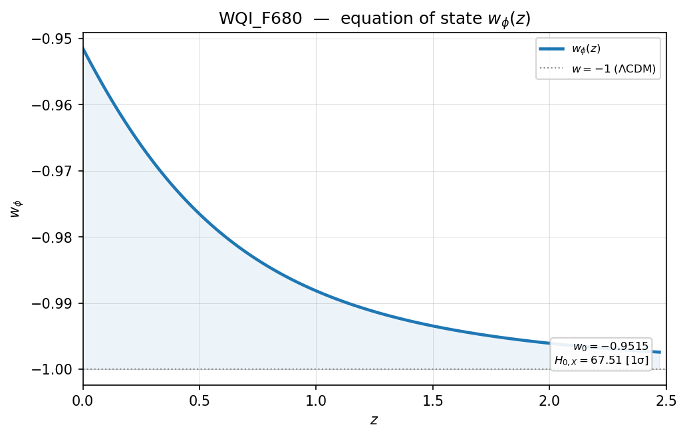
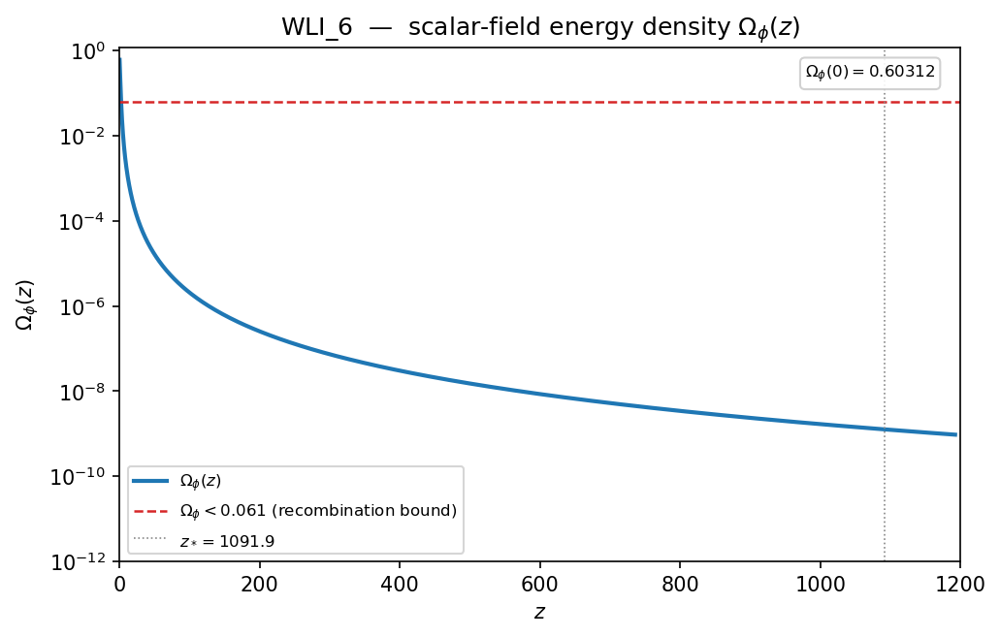
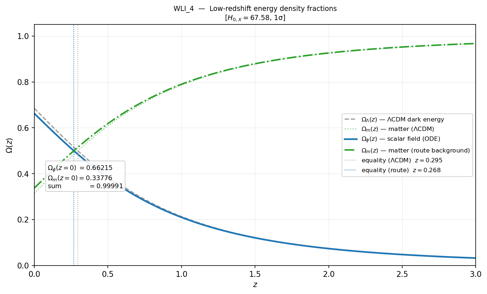
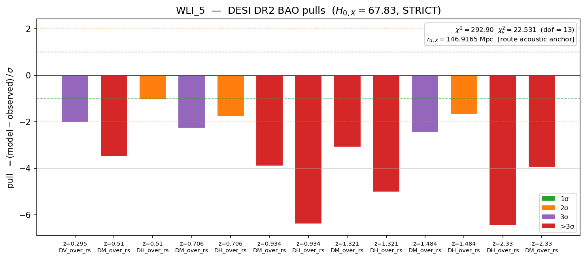
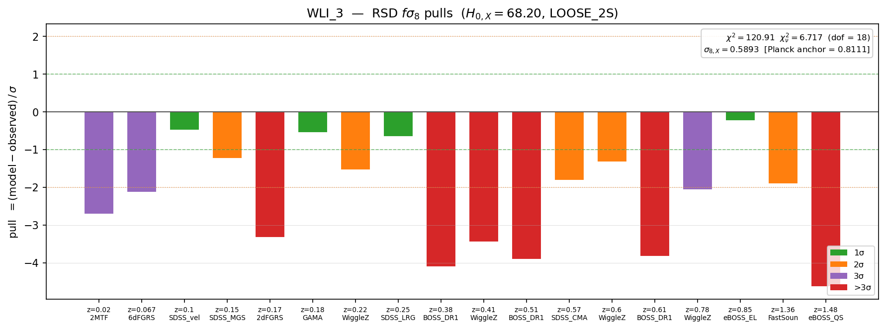
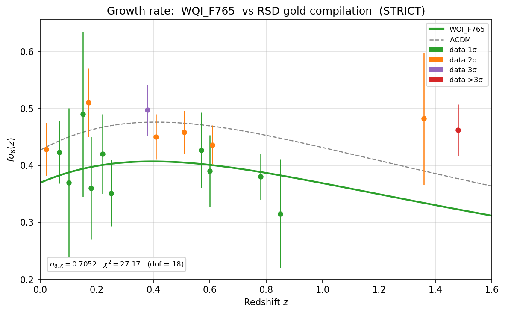
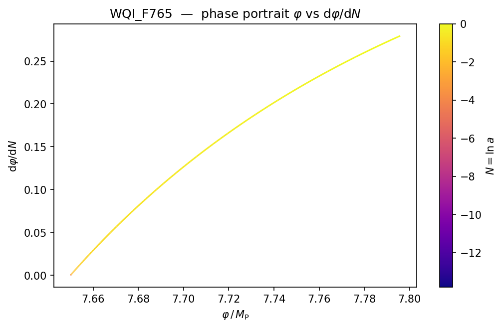

# Plot Outputs Reference

TFA writes diagnostic plots into each run folder. The release repository also
includes a small gallery of sample plots in:

```text
figurers/
```

The gallery files were copied from the paper's example run outputs and include
both raster (`.png`) and vector (`.pdf`) versions where available.

## Plot products

| Plot stem | Written by | Availability | Purpose |
|---|---|---|---|
| `w_of_z` | `tfa_plot_exporter` | Always after successful acoustic integration. | Shows scalar equation-of-state history at low redshift. |
| `Omega_phi` | `tfa_plot_exporter` | Always after successful acoustic integration. | Shows scalar energy-density fraction over the trajectory. |
| `phase_portrait` | `tfa_plot_exporter` | Always after successful acoustic integration. | Shows the scalar-field phase trajectory. |
| `energy_fractions` | `tfa_plot_exporter` | Requires `results.acoustic_validator.energy_fractions`. | Compares low-redshift route and reference matter/dark-energy fractions. |
| `H_of_z` | `tfa_plot_exporter` | Requires `expansion_history_h0x_normalized.csv`. | Shows the acoustic-normalized route Hubble history. |
| `delta_H` | `tfa_plot_exporter` | Requires `expansion_history_h0x_normalized.csv`. | Shows the difference between route and reference Hubble histories. |
| `bao_pulls` | `tfa_bao_validator` | Requires successful BAO validation. | Shows BAO per-datum normalized residuals. |
| `rsd_pulls` | `tfa_rsd_validator` | Requires successful RSD validation. | Shows RSD per-datum normalized residuals. |
| `rsd_growth` | `tfa_rsd_validator` | Requires successful RSD validation. | Shows the route `f_sigma8(z)` curve against RSD measurements. |

When the export gate rejects a route, `H_of_z`, `delta_H`, BAO plots, and RSD
plots are skipped because the normalized-history CSV is absent. The always
available scalar-state plots can still be written.

## Sample gallery

The `figurers/` folder contains the following sample plots:

| File | Description |
|---|---|
| `WQI_F765_H_of_z.png/pdf` | Normalized expansion history for `WQI_F765`. |
| `WLI_4_H_of_z.png/pdf` | Normalized expansion history for `WLI_4`. |
| `WQI_F680_w_of_z.png/pdf` | Scalar equation-of-state history for `WQI_F680`. |
| `WLI_2_w_of_z.png/pdf` | Scalar equation-of-state history for `WLI_2`. |
| `WLI_1_Omega_phi.png/pdf` | Scalar energy-density fraction for `WLI_1`. |
| `WLI_6_Omega_phi.png/pdf` | Scalar energy-density fraction for `WLI_6`. |
| `WLI_5_bao_pulls.png/pdf` | BAO pull diagnostics for `WLI_5`. |
| `WLI_3_rsd_pulls.png/pdf` | RSD pull diagnostics for `WLI_3`. |
| `WQI_F765_rsd_growth.png/pdf` | RSD growth-rate comparison for `WQI_F765`. |
| `WQI_F765_phase_portrait.png/pdf` | Phase portrait for `WQI_F765`. |
| `WLI_4_energy_fractions.png/pdf` | Low-redshift energy-fraction comparison for `WLI_4`. |

The folder also includes additional PNG examples for `WLI_1`, `WQI_F680`, and
other route/plot combinations used during the paper figure selection.

## How to read the plots

### Normalized expansion history

`H_of_z` plots show the route's low-redshift Hubble history after acoustic
normalization has fixed `H0_X` and the distance scale. Inspect this plot before
moving to scalar-state or observational-pull diagnostics because it shows the
background that BAO and RSD consume.

Representative examples:





### Scalar equation of state

`w_of_z` plots show the scalar equation-of-state history `w_phi(z)`. They are a
quick visual check of thawing behavior and the route's distance from the
phantom boundary.

Representative examples:




### Scalar density fraction

`Omega_phi` plots show the scalar energy-density fraction. In the paper
examples, `WLI_1` and `WLI_6` are shown side by side to compare routes from
different acoustic bands.

Representative examples:




### Energy fractions

`energy_fractions` plots compare route-level scalar and matter fractions with
the reference matter/dark-energy equality redshift. They use the
`energy_fractions` block written into `run_results_summary.json`.

Representative example:



Vector version: `figurers/WLI_4_energy_fractions.pdf`

### BAO pulls

`bao_pulls` plots encode the BAO residual vector in one panel. Each bar is a
normalized residual:

```text
(model - observed) / sigma
```

The color band marks whether the datum falls within one, two, or three sigma,
or outside three sigma. Use this plot to identify which redshifts and
observables dominate the BAO chi-squared.

Representative example:



### RSD pulls and growth

`rsd_pulls` uses the same pull-bar format for the RSD `f_sigma8` compilation.
`rsd_growth` gives a complementary view by overlaying the route's
`f_sigma8(z)` prediction directly on the data points with uncertainty bars.

Representative examples:





### Phase portrait

The phase portrait traces `(phi, dphi/dN)` from the frozen initial condition
toward the present epoch. It is useful for inspecting the scalar trajectory
directly rather than only its derived expansion history.

Representative example:



## Source data

Plots are inspection products. The citeable numerical source remains the CSV
and JSON output in the run folder:

- `trajectory.csv`
- `expansion_history_h0x_normalized.csv`
- `bao_results_per_datum.csv`
- `rsd_results_per_datum.csv`
- `run_results_summary.json`

See `docs/csv-outputs-reference.md` and `docs/run-summary-reference.md` for the
field-level documentation behind the plotted values.
